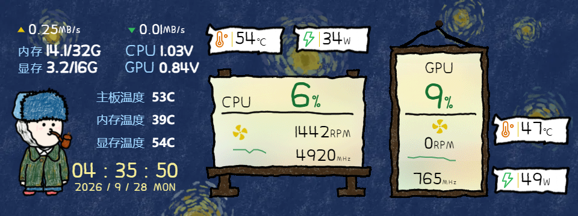

# Myth.Cool Skin Hack

> **不替代官方软件，直接在运行时改它的皮肤。**
>
> 给瓦尔基里（Valkyrie）机箱副屏 / 水冷屏的 Myth.Cool 加数据项、调排版、改样式 ——
> 全程**不改任何文件**，重启即恢复；官方软件、官方皮肤、触摸交互**完整保留**。

[English](README.en.md) · 中文

---

## 目录

- [配套 AI 技能包](#配套-ai-技能包)
- [这是什么](#这是什么)
- [和其他开源方案的区别](#和其他开源方案的区别-)
- [特性](#特性)
- [效果](#效果)
- [快速开始](#快速开始)
- [工作原理](#工作原理)
- [版本升级自检（官方软件更新后必做）](#版本升级自检官方软件更新后必做)
- [文档](#文档)
- [兼容性](#兼容性)
- [已知现象：副屏偶尔闪黑（与本项目的关系）](#已知现象副屏偶尔闪黑与本项目的关系)
- [卸载 / 回滚](#卸载--回滚)
- [免责声明](#免责声明)

---

## 配套 AI 技能包

不想自己读文档、量坐标？本仓库带一个配套 AI 技能包 [`skill/`](skill/) —— 装进你的
AI 智能体，之后直接用自然语言下指令：「给皮肤加个主板温度」「把内存改成 GB 绝对值」。

- **WorkBuddy**：复制到 `~/.workbuddy/skills/mythcool-skin-injector/`
- **Claude Code**：复制到 `~/.claude/skills/mythcool-skin-injector/`

技能不绑定具体硬件：注入链路作用于 Myth.Cool 应用本身，**已在瓦尔基里 VK03 机箱副屏
（360×960）上全套实测成功**；其他 Myth.Cool 设备（水冷头、其他型号机箱屏等）机制相同、
大概率通用，几何细节用技能自带探针实测一遍即可。详见 [`skill/README.md`](skill/README.md)。

---

## 这是什么

Myth.Cool 是瓦尔基里全系带屏设备的官方软件（E / V / B / B-GT / GLA / N 系列水冷，
R / AL / ML / DX 系列风冷，VK02 / VK03 / VK03-TOU / VK05 机箱副屏）。

它能显示硬件监控数据、能换皮肤，但**皮肤本身是锁死的**：

- 布局固定，想挪个位置、调个字号，官方不给
- 数据项有限，想加个主板温度 / 内存温度 / 显存温度，没有入口
- 内存显存只有百分比，想看 GB 绝对值，做不到

这些皮肤打包在 `webapp.gpk` 里，**带完整性校验** —— 直接改文件会让整个皮肤失效。

**本项目用 Frida 运行时注入解决这件事**：往 Myth.Cool 的 Electron 主进程注入一段 JS，
让它把补丁送进渲染进程（皮肤页面）。注入的内容是：

1. 一个 `<style>` 标签 —— 排版、字号、颜色、位置
2. 若干自建 DOM 节点 —— 新数据项
3. 一个 3 秒刷新节拍 —— 让新数据项跟着原生节拍跳，不会冻住

**全部活在内存里。不写盘、不改 gpk、不碰皮肤文件。** 再配一层计划任务，
软件每次重启（开机 / 睡醒 / 手动）后自动把补丁打回去。

---

## 和其他开源方案的区别 ★

GitHub 上已有一批同类开源项目，走的是**另一条路** —— 绕过 Myth.Cool，自己写程序直接驱动 USB 屏：

| 项目 | 语言 | 路线 | 备注 |
|---|---|---|---|
| [ZGMFX01A/MythCool-Lite](https://github.com/ZGMFX01A/MythCool-Lite) | Rust | **完全替代**，自带驱动栈（VK: WinUSB / MS: libusb-win32） | 最接近本项目的替代方案 |
| [itsmylife44/LcdFusion](https://github.com/itsmylife44/LcdFusion) | C# | 直连 USB，需 Zadig 换驱动 | 同时支持 Thermalright |
| [codehz/msdisplay](https://github.com/codehz/msdisplay) | Python | Linux 用户态驱动 | 逆向 + 净室实现 |
| [kerbalwzy/lcdcanvas](https://github.com/kerbalwzy/lcdcanvas) | Python | 主题化绘制框架 | 通用 LCD 画布 |

### 那类方案的代价

- 要先用 **Zadig 把屏幕的 USB 接口从厂商驱动换成 libusb / WinUSB** —— 换驱动是有风险的操作
- 因为 USB 设备被独占，**必须先关掉 Myth.Cool** 才能推流
- **官方皮肤体系用不了**（皮肤商店的、联名款、你花钱买的，全部失效）
- 显示内容只能自己画（图片 / GIF / 视频 / 自建面板）

### 本项目的取舍

**本项目不替代 Myth.Cool，而是"住进"它里面改皮肤。**

| 能力 | 替代类方案 | 本项目 |
|---|---|---|
| 官方软件功能（传感器接入 / 皮肤商店 / 灯光 / 风扇控制） | ❌ 必须关掉官方软件 | ✅ **完整保留** |
| 官方皮肤（含联名 / 付费皮肤） | ❌ 用不了 | ✅ **照常下载、照常修改** |
| USB 驱动 | ⚠️ 需 Zadig 换成 libusb / WinUSB | ✅ **完全不碰** |
| 触摸 / 原生交互 | ⚠️ 可能失效 | ✅ **原样保留** |
| 文件改动 | — | ✅ **零改动**（gpk 有完整性校验，改了就废） |
| 可逆性 | 要卸载驱动 | ✅ **删个计划任务即可** |
| 给官方皮肤加数据项 | ❌ 只能自己做面板 | ✅ **直接加进官方皮肤** |
| 实时调参 | 重新编译 / 重启 | ✅ **改个 JSON 立即生效** |
| 资源占用 | ✅ 更低（MythCool-Lite 自述内存 ~864MB → 35–50MB） | ⚠️ 跟随官方软件 |
| 依赖官方软件 | ✅ 完全不依赖，官方停更也能用 | ❌ **硬依赖**：官方停更、换渲染架构或改 V8 版本，本项目**一起失效，且可能是静默的**（见[版本升级自检](#版本升级自检-官方软件更新后必做)） |

**一句话**：替代方案是「**换掉这个软件**」，本项目是「**改这个软件**」。

想彻底轻量化、摆脱官方软件 → 用替代方案。
想保住官方软件和皮肤生态、只想改显示内容 → 用本项目。

---

## 特性

- 🎛 **官方皮肤全改造** —— 任意组件的位置、字号、颜色、间距、排列顺序
- ➕ **新增数据项** —— 从皮肤已有的传感器数据里取（主板温度 / 电压、内存温度、显存温度、内存 / 显存容量……）
- 🔄 **自带刷新节拍** —— 新增项与原生屏幕节拍（3 秒）精确对齐，靠值去重不抢 DOM
- 🚀 **开机自启** —— 计划任务每分钟查一次进程，一变就自动打补丁；平时开销 **~120 ms / 次**，约 0.07% 单核
- 🪟 **零窗口** —— 全静默，不会有黑框闪一下（wscript GUI 子系统 + 隐藏启动）
- 🧩 **幂等** —— 只在进程真正变化时动手，失败不记账、下一轮自动重试
- 🔥 **热调** —— 改 `tune.json` 保存即生效：不重启软件、不重跑安装、不点 UAC
- ♻️ **完全可逆** —— 删计划任务 + 删目录 = 干净，不留任何痕迹

---

## 效果



*（图为 VK03 机箱副屏，用户视角。原始皮肤上的内存 / 显存行被改造为「电压 + 中文标签 + GB 绝对值」，
并新增了主板 / 内存 / 显存温度三项，全部跟随原生 3 秒节拍刷新。）*

改造前后对照见 `assets/before-after.png`。

---

## 快速开始

### 前提

- Windows 10 / 11
- 已安装官方 **Myth.Cool** 并能正常显示
- **Python 3.9+**（安装脚本会自动建 venv 并安装 frida；没装 Python 请先装）

### 安装

1. 把本项目下载到任意目录（不要放在会被删的临时目录）
2. **右键 → 以管理员身份运行** `tools\Install.bat`
   （需要管理员：计划任务要以最高权限运行，frida 才能附加到 Myth.Cool 主进程）
3. 按提示走完 4 步，看到 `[OK] injection succeeded` 即成功

安装脚本会：

```
[1/4] 验证静默启动器
[2/4] 注册计划任务 \MythCoolSkinHack
[3/4] 立即执行一次注入
[4/4] 报告结果
```

之后**每次开机 / 睡醒 / 软件重启**，补丁都会自动打回去。

### 调参

改 `tune.json` 保存即可，**1 秒内生效**：

```jsonc
{
  "ix": 169,          // 新增数据项的横向位置
  "tops": { "mbt": 150, "memt": 188, "vrt": 226 },   // 各项纵向位置
  "ifs": 20,          // 新增项字号
  "hide": ["mbv"],    // 隐藏某项
  "css": "..."        // 任意追加 CSS（排版主战场）
}
```

改坏了也不怕：把 `tune.json` 换回默认值，或者重启 Myth.Cool 即回到原始皮肤。

---

## 工作原理

```
┌─────────────┐   Frida attach    ┌──────────────────────────────┐
│ 安装脚本     │ ────────────────► │ Myth.Cool 主进程 (Electron)   │
│ (Python +   │                   │                              │
│  frida)     │  V8 C++ API 注入   │  hook uv_timer_start ──┐     │
└─────────────┘                   │                        ▼     │
                                  │  ① 自建脚本注入主进程          │
                                  │  ② 主进程 executeJavaScript   │
                                  │     送补丁进渲染进程 ─────────┐│
                                  └───────────────────────────────┘│
                                                                   ▼
                                             ┌──────────────────────────┐
                                             │ 渲染进程（皮肤 mainpage）  │
                                             │ · 追加 <style>           │
                                             │ · 新建数据项 DOM 节点      │
                                             │ · setInterval 3s 刷新    │
                                             └──────────────────────────┘
```

关键点：

- **注入用 V8 C++ API 链**（`Isolate::GetCurrent` → `GetCurrentContext` → `Script::Compile` → `Script::Run`），
  绕开 Electron 的模块隔离，直接在主进程上下文里跑 JS
- **注入时机靠 hook `uv_timer_start` / `uv_async_send`** —— 借事件循环的线程进入 V8
- **补丁靠 `webContents.executeJavaScript` 送进渲染进程** —— 这是 Electron 官方 API，稳
- **热调靠主进程里的 `fs.watchFile`** 监听 `tune.json`，变了就重推
- **持久化靠计划任务** 每分钟比对进程 PID，只在变化时注入（PID 判据用**父子关系**，
  因为 Electron 会派生一堆同名的 gpu / renderer 子进程，靠启动时间分不出来）

细节见 [`docs/`](docs/)。

---

## 版本升级自检（官方软件更新后必做）★

**这是本项目最脆的一环，值得单独一节。** 注入链靠 Frida 在 Myth.Cool 主进程里用
**V8 的 MSVC mangled 符号名**（`?GetCurrent@Isolate@v8@@...` 这类）拿函数指针 ——
这些名字**与 V8 版本强耦合**。官方软件更新 Electron/V8 大版本后，符号名会变：

- **v20 起**：符号缺失会在日志里显式报 `SYM MISS`，`last_result.json` 写 `"symMiss": true`，
  进程退出码 3 —— **不会静默失败**，计划任务也不会无意义重试
- **v19 及更早**：静默失效，表面上一切正常但注入再也不成功

**官方软件更新后，按顺序做：**

1. 重启一次 Myth.Cool，让计划任务自动注入一次
2. 看 `C:\ProgramData\MythCoolInject\log\inject.log` 尾部：
   - 有 `SYM MISS` / `last_result.json` 里 `"symMiss": true` → 符号变了，需要重新 dump
   - 有 `OK 注入成功` → 一切照旧
3. 重新 dump 符号的方法：用 Frida attach 主进程后
   `Module.enumerateExports('node.exe' 目标模块)` 按未修饰名（`Isolate::GetCurrent` 等）
   模糊搜索，把新 mangled 名填回注入源的 `Syms` 表（见 skill 包 `inject_main_v20_final.py`）
4. 改完跑 `synchk.py` 静态校验（全绿才部署），再走装机流程

> ⚠️ **attach 被拒 ≠ 符号问题**：如果注入器以非管理员权限 attach 一个**提权运行的**
> Myth.Cool 主进程，会报 `ProcessNotRespondingError` 之类误导性错误 —— 先用任务管理器
> 确认 Myth.Cool 是不是以管理员在跑（正常安装默认不是），再怀疑符号。

---

## 文档

| 文档 | 内容 |
|---|---|
| [`docs/01-原理.md`](docs/01-原理.md) | 为什么必须用运行时注入；V8 注入链；为什么注入完能退出 |
| [`docs/02-使用与调参.md`](docs/02-使用与调参.md) | 安装、`tune.json` 字段详解、怎么量位置、改造配方 |
| [`docs/03-持久化.md`](docs/03-持久化.md) | 计划任务的幂等 / 无窗口 / 性能设计；为什么不做事件触发 |
| [`docs/04-踩坑合集.md`](docs/04-踩坑合集.md) | ★ **本项目最有价值的部分**：15 条真踩过的坑，每条都给症状→原因→正确做法 |
| [`docs/05-闪黑排查.md`](docs/05-闪黑排查.md) | 副屏偶尔闪黑与注入器的关系：A/B 对照、排除项、网上案例（含区分）、处置尝试与排查方向（**根因未定位；重装缓解不根治**） |

> 如果你只想读一篇，读 [`docs/04-踩坑合集.md`](docs/04-踩坑合集.md)。

---

## 兼容性

**已在以下环境验证**：

| 项 | 值 |
|---|---|
| 设备 | 瓦尔基里 VK03 机箱副屏（USB `345F:9132`，360×960） |
| 皮肤 | AeeBiCui「博物馆1」 |
| 软件 | Myth.Cool（2026-09 版本） |
| 系统 | Windows 11 |

**理论上通用**：所有用 Myth.Cool 的带屏设备（E / V / B / B-GT / GLA / N 系列水冷，
R / AL / ML / DX 系列风冷，VK02 / VK03 / VK03-TOU / VK05 机箱副屏），
只要皮肤是 web 技术渲染的就能用 —— 但**具体的 CSS 选择器和坐标需要按你的皮肤重新量**。

`tune.json` 里的默认值是按上述环境调的，换成别的皮肤时**排版数值需要自己校正**
（方法见 [`docs/02-使用与调参.md`](docs/02-使用与调参.md)）。

### 支持 / 可能支持的设备

官方 Myth.Cool 覆盖的全部带屏设备（本项目理论上都能用，只是具体排版数值要自己量）：

| 类别 | 系列 |
|---|---|
| 一体式水冷 | **E** / **V** / **B / B-GT** / **GLA** / **N** 系列（带屏款） |
| 风冷散热器 | **R** / **AL** / **ML** / **DX** 系列（带屏款） |
| 机箱副屏 | **VK02** / **VK03** / **VK03-TOU** / **VK05** |

USB 设备 ID：机箱副屏 `345F:9132`（MS9132），水冷屏 `374A:A021`。

---

## 已知现象：副屏偶尔闪黑（与本项目的关系）

本项目作者在使用期间遇到过副屏**不定期闪黑**（黑几十到几百毫秒后画面自愈、内容还在）。
经过逐毫秒推流日志分析、停用注入器 A/B 对照、清洁重装、系统事件取证等多方面测试 ——
**截至本文更新，具体原因仍未定位。** 目前能负责任说的：

- **不能完全确认注入器零影响，但它大概率不是闪黑的主因** —— 停用注入器期间闪黑照样发生；
  复现时刻的推流心跳、注入器日志、系统事件三条线全部干净（见 docs/05 §4.2）
- **清洁卸载重装（方案见 docs/05）实测只是缓解，不根治** —— 重装后数小时未复现，当晚仍闪；
  仍值得做（成本最低，顺便排掉灰度版本混用变量），但别指望它单独解决问题
- **作者个人判断大概率是 Myth.Cool 软件侧的问题**（渲染层或更深处），具体环节在用户侧很难查清
- 网上的同类案例要**注意区分**：有的是伴随整机死机的长黑屏、有的是屏模块批次问题
  （网上确有「售后换屏解决」的先例），未必和本文现象同类

如果有人也想排查这个问题：docs/05 把查过的方向（注入器 A/B、电源管理、USB 接口、
灯控冲突、清洁重装、皮肤来源等）如实列出，可以直接当参考。

完整排查记录（现象定性、排除项、灰度版本混用发现、网上案例来源表、排查顺序）
见 [`docs/05-闪黑排查.md`](docs/05-闪黑排查.md)。

---

## 关键词

> 单纯为了能被搜到。如果你是从搜索引擎或 GitHub 搜到这里的 —— 这些词都指向本项目。

**中文**
瓦尔基里 副屏 · 机箱副屏 改造 · 水冷屏 自定义 · 屏幕 显示 内容 修改 · 皮肤 修改 排版 ·
内存 显存 显示 GB 绝对值 · 主板温度 内存温度 显存温度 · 加数据项 · 字号 位置 调整 ·
不替换官方软件 · 不改文件 · 可逆

**闪屏 / 闪黑**
副屏 闪黑 · 副屏 闪屏 · 机箱屏 黑屏 · 机箱副屏 闪屏 · 屏幕 黑一下 又恢复 ·
副屏 闪黑 排查 · VK03 闪屏 · Myth.Cool 黑屏 · 水冷屏 闪屏 · 副屏 黑屏 自愈 ·
闪屏 注入 有关吗 · 换屏 解决 黑屏

**产品**
瓦尔基里 VK02 / VK03 / VK03-TOU / VK05 机箱副屏 ·
E / V / B / B-GT / GLA / N 系列水冷 · R / AL / ML / DX 系列风冷 ·
Valkyrie · Myth.Cool · MS9132 · `345F:9132` · `374A:A021`

**English**
Valkyrie · Myth.Cool · case screen · sub display · secondary LCD · AIO cooler display ·
LCD skin · runtime skin patching · Frida injection · Electron patch ·
add sensor fields · memory & VRAM in GB · mainboard / memory / VRAM temperature ·
case mod · PC modding · hardware monitor overlay · VK03 · VK05

---

## 卸载 / 回滚

```bat
:: 删除计划任务（需要管理员）
schtasks /Delete /TN MythCoolSkinHack /F

:: 删除程序目录
rmdir /s /q C:\ProgramData\MythCoolSkinHack
```

**只删计划任务、不跑安装器**，注入的补丁也会在下次 Myth.Cool 重启后完全消失。

**本项目涉及的计划任务只有一个**：`MythCoolSkinHack`。如果你的机器上还看到
`MythCoolScreenFix` / `MythCoolFix`（`C:\ProgramData\MythCoolFix\`）—— 那是**另一套
独立的「唤醒后副屏睡死」修复工具**（睡眠唤醒后重启 Myth.Cool），**不属于本项目**，
删不删与本项目无关；两者共存没有冲突（它重启 Myth.Cool 后，本项目的计划任务会
在下一分钟自动重新注入）。

想临时看看原始皮肤长什么样？直接重启 Myth.Cool 即可（补丁全在内存里，重启即净）。

---

## 免责声明

- 本项目**只修改运行中的进程内存**，不修改、不重分发 Myth.Cool 的任何文件、二进制或素材
- 「Valkyrie」「Myth.Cool」等名称仅用于**描述兼容性**，本项目非官方产品，与厂商无关联
- 注入第三方进程存在**理论上的稳定性风险**，请自行评估。本项目通过「零落盘 + 完全可逆 + 失败不记账」
  把风险控制到最低，但不对任何后果作担保
- 用于**学习研究**目的

## License

MIT —— 见 [LICENSE](LICENSE)
